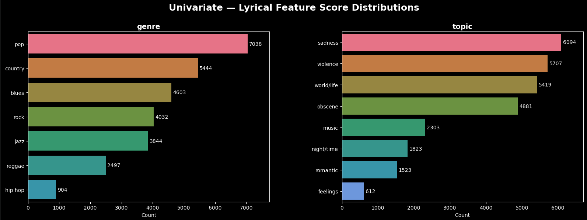
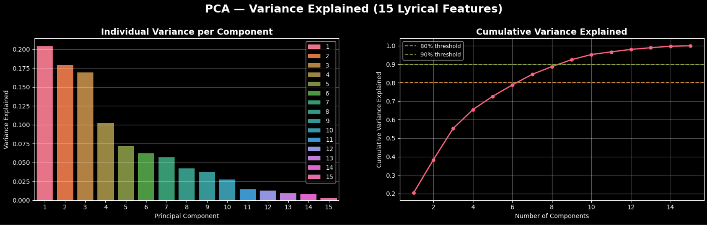
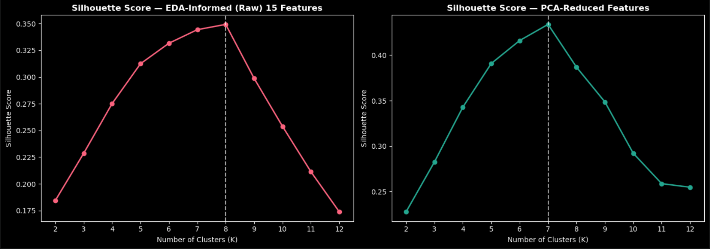
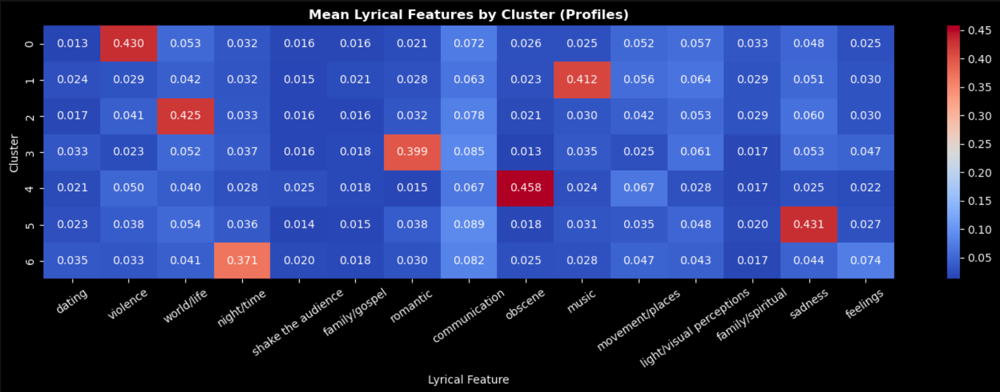
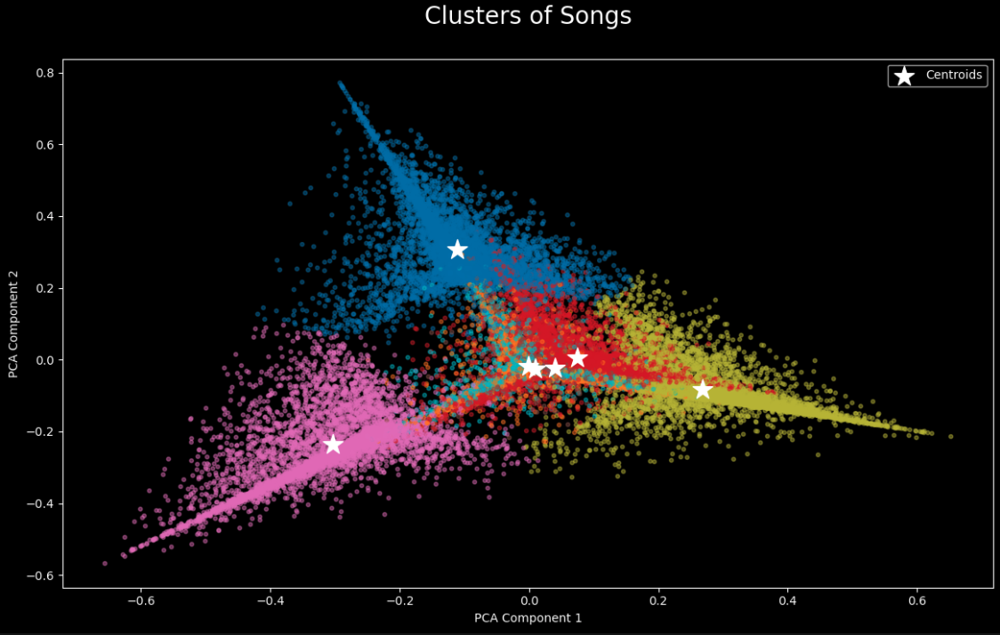
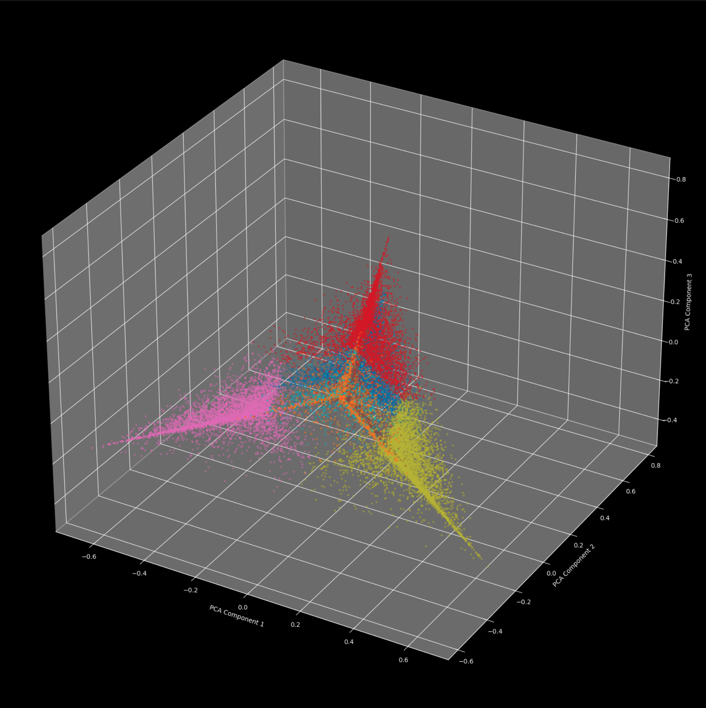

# Music Recommendation Project
This project explores unsupervised machine learning techniques applied to a real-world music dataset spanning songs from 1950 to 2019. As a data scientist at a Series B music start-up, the goal is to build a song recommendation engine from scratch by clustering unlabeled tracks based on their lyrical and continuous audio features (identifying patterns in song lyrics and metadata to generate meaningful song clusters that group similar tracks together without relying on labeled training data).
The dataset includes artist information, song metadata, pre-tokenized lyrics, and a set of engineered lyrical features representing thematic content. The project focuses on understanding these features, reducing dimensionality, and applying clustering algorithms to uncover structure in the music space.

Read more about the dataset features and column descriptions in [features_info.md](docs/features_info.md).

Full answers to the 5 project questions in [Final Report Q&A](report_qa.md).


## Project Structure

```
music_recommendation_ml/
│
├── code/
│   ├── 1_explore.ipynb        # EDA — univariate, bivariate, multivariate analysis
│   ├── 2_transform.ipynb      # Cleaning, feature selection, scaling, PCA
│   ├── 3_model.ipynb          # KMeans training, elbow + silhouette evaluation
│   └── 4_predict.ipynb        # Cluster prediction on new user listening history
│
├── data/
│   ├── train.csv              # Raw training data
│   ├── recommend.csv          # New user listening history (test set)
│   ├── cleaned_data/
│   │   ├── cleaned_train.csv          # 15 EDA-informed scaled features
│   │   └── cleaned_train_pca.csv      # PCA-reduced version (7 components)
│   └── clustered_data/
│       ├── clustered_train.csv        # Training data with cluster labels
│       └── clustered_recommend.csv    # New user history with cluster labels
│
├── docs/
│   ├── 1_report_qa.md         # Final Q&A report
│   └── features_info.md       # Dataset column descriptions
│   ├── clusters_2d.png
│   ├── clusters_3d.png
│   ├── genre_topic_score_distributions.png
│   ├── mean_lyrical_feat_by_cluster.png
│   ├── pca.png
│   └── sil_scores.png
│
├── README.md
└── .gitignore
```

### Notebook 1 — EDA (Hypothesis Formulation)
Univariate, bivariate, and multivariate exploration to understand the dataset and formulate a clustering hypothesis.

Key findings:
- **28,362 songs** across 24 features. 4 dominant genres: Pop, Blues, Rock, and Country


- **Hip hop is a strong lyrical outlier** — its mean `obscene` score (r=0.41) is 4–6× higher than every other genre (all between 0.06–0.14). This single feature has the highest variance across genre group means, making it the most powerful separator.
- **No feature pair exceeded r = 0.50**, so no features were dropped for multicollinearity
- **Genre composition shifted by decade** — Hip Hop is absent before the 1990s; Pop and Rock dominate earlier decades. This temporal skew means `age` encodes genre-era information implicitly.
- **`topic` is derived from lyrical scores** — each topic label simply reflects whichever lyrical dimension scored highest for that song, making it redundant as a feature.

We hypothesize that K‑Means will identify approximately four clusters. These clusters likely correspond to the dominant lyrical‑feature patterns we observed:
1. High-obscene → hiphop songs
2. High-sadness → country/pop 
3. Violence → rock/blues
4. World/life → reggae


### Notebook 2 — Transform (Cleaning, Wrangling & Preprocessing)
EDA-informed decisions on what to keep, what to drop, and whether PCA adds value.

**Columns dropped:**

| Column | Reason |
|--------|--------|
| `Unnamed: 0` | Row index artifact |
| `artist_name`, `track_name` | Identifiers, not features |
| `lyrics` | Raw text — not used in this pipeline |
| `release_date` | Would anchor clusters to era, not lyrical content |
| `age` | Redundant with `release_date`; implicitly encodes genre era |
| `topic` | Derived directly from lyrical scores — circular |
| `len` | Measures song length, not lyrical theme; the only non-0–1 column |


`genre` was not included in training (would bias clusters toward known boundaries and defeat the point of unsupervised learning)

**Scaling:** The 15 remaining lyrical features are already on a uniform 0–1 scale, so no `StandardScaler` was needed. Each feature contributes equally to KMeans distance without normalization.

**PCA:** Run for comparison against the raw 15-feature set. Results showed:
- 7 components cross the 80% variance threshold
- PCA compresses poorly (expected — low inter-feature correlation), but was still tested against the raw set using silhouette scoring to let the data decide


Outputs saved: `cleaned_train.csv` (15 EDA-informed raw features) and `cleaned_train_pca.csv` (7 PCA-reduced components).


### Notebook 3 — KMeans Training & Evaluation
Two feature sets (raw vs. PCA-reduced) evaluated side-by-side using the Elbow Method and Silhouette Scoring to pick the best K.

**Elbow Method:**
- EDA-Informed (Raw): flattens around K=6–7
- PCA-Reduced: more defined elbow at K=7

**Silhouette Scores:** PCA-reduced consistently outperformed raw features — removing inter-feature noise tightened the clusters. Peak score: **K=7, silhouette = 0.4338**


**Final model:** `KMeans(n_clusters=7, init='k-means++', n_init=10, random_state=42)` on PCA-reduced features.

**Cluster profiles:**


| Cluster | Name | Dominant Feature | Description |
|---------|------|-----------------|-------------|
| 0 | Dark & Aggressive | `violence` | High violence, low romantic and gospel. Confrontational lyrics. |
| 1 | Songs About Music | `music` | High music score — songs that reference music itself. Likely jazz/blues. |
| 2 | Reflective / Philosophical | `world/life` | High world/life. Songs about society, existence, and meaning. |
| 3 | Romantic Ballads | `romantic` | High romantic + dating, low violence and obscene. Classic love songs. |
| 4 | Explicit / Hip Hop | `obscene` | High obscene — explicit content, money, lifestyle. Skews heavily hip hop. |
| 5 | Melancholic | `sadness` | High sadness + feelings. Heartbreak and loss. Common in blues and country. |
| 6 | Nightlife & Energy | `night/time` | High night/time + shake the audience. High-energy songs about dancing and nightlife. |




Clustered dataset saved as `clustered_train.csv`.


### Notebook 4 — Recommendation via Cluster Prediction
Treats `recommend.csv` as a user's listening history (10 songs). The trained KMeans model assigns each song a cluster, and the top 3 dominant clusters form the user's taste profile.

**User's taste profile:**
- Dark & Aggressive (3 songs)
- Melancholic (2 songs)
- Reflective / Philosophical (2 songs)

Clustered recommend is saved to `clustered_recommend.csv` and final recommendations saved to `recommendations.csv`.

Sample recommendations:

| Artist | Song | Genre | Cluster |
|--------|------|-------|---------|
| Rush | Losing It | Rock | Dark & Aggressive |
| Dr. Feelgood | Milk and Alcohol | Blues | Dark & Aggressive |
| Mercyful Fate | Evil | Rock | Dark & Aggressive |
| UNKLE | Unreal | Jazz | Reflective / Philosophical |
| The Doors | End of the Night | Rock | Reflective / Philosophical |
| The Youngbloods | Beautiful | Country | Melancholic |
| John Coltrane | All or Nothing at All | Jazz | Melancholic |
| Hank Thompson | I Was the First One | Country | Melancholic |
